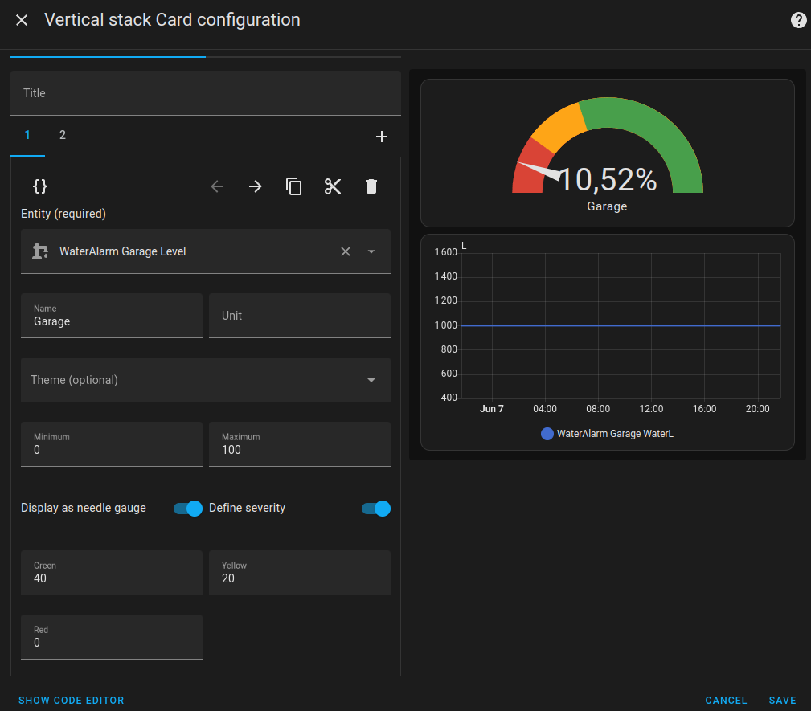

# Home Assistant

Om de data van WaterAlarm in te lezen met Home-Assistant dien je de configuratie
manueel aan te passen.

## Stap 1: Configuratie-bestand openen

Dit hangt af van je soort installatie:  
https://www.home-assistant.io/docs/configuration/

Als je Home Assistant OS gebruikte, kan deze video ook nuttig zijn:  
https://www.youtube.com/watch?v=7AU5i-WUUxw

Het configuratie-bestand dat je nodig hebt is `configuration.yaml`.
Let goed op de spaties om de lijnen te laten inspringen.  Die zijn belangrijk.  De syntax is in *yaml*, meer info vind je op [Wikipedia](https://en.wikipedia.org/wiki/YAML).

## Stap 2: Configuratie file aanpassen

Voeg onderaan in de file deze blok toe:

``` yaml
rest:
  - resource: https://www.wateralarm.be/api/a/abc1234567/s/xyz7654321
    scan_interval: 10
    sensor:
      - name: "WaterAlarm Regenput Volume"
        icon: mdi:water-pump
        value_template: "{{ value_json.lastMeasurement.waterL }}"
        unit_of_measurement: "L"
      - name: "WaterAlarm Regenput Niveau"
        icon: mdi:water-pump
        value_template: "{{ (value_json.lastMeasurement.levelFraction * 100.0) | round(2) }}"
        unit_of_measurement: "%"
```

Je moet de link aanpassen voor jou sensor.  Jouw link vind je terug op je sensor pagina: ga naar *Details*, en daar vind je de *API Link*.  
In het voorbeeld hierboven worden 2 waarden uitgelezen voor de sensor: *Volume* (`waterL`) en *Niveau* (`levelFraction`).  
Je kunt het volledige resource blok (`- resource:...`) herhalen voor meerdere sensoren.  Geef ze dan wel een verschillende naam (`name`), bvb 'WaterAlarm Woning ...' en 'WaterAlarm Garage ...'.  
Zet het scan_interval niet lager dan 20 (= 20 minuten).  

Hoe je het bestand kunt bewaren en opnieuw inlezen is uitgelegd in de link in Stap 1.

## Stap 3: De sensor-gegevens op je Home-Assistant dashboard plaasen

Na het opnieuw inlezen van het configuratie-bestand kun je de ingelezen waarden gebruiken.

``` json
type: vertical-stack
cards:
  - type: gauge
    entity: sensor.wateralarm_regenput_niveau
    min: 0
    max: 100
    severity:
      green: 40
      yellow: 20
      red: 0
    needle: true
    name: Garage
  - type: history-graph
    entities:
      - entity: sensor.wateralarm_regenput_volume
```


