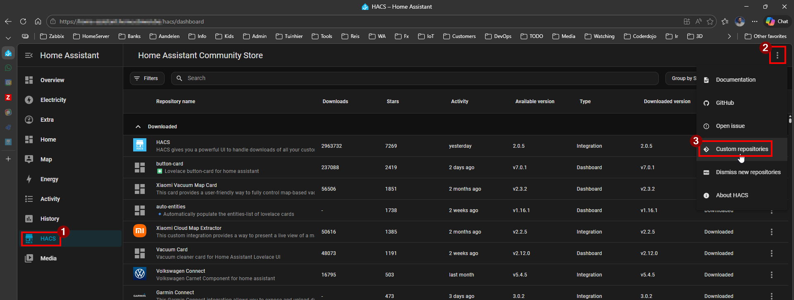
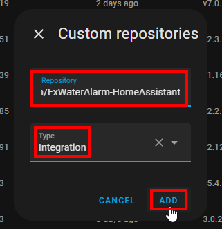
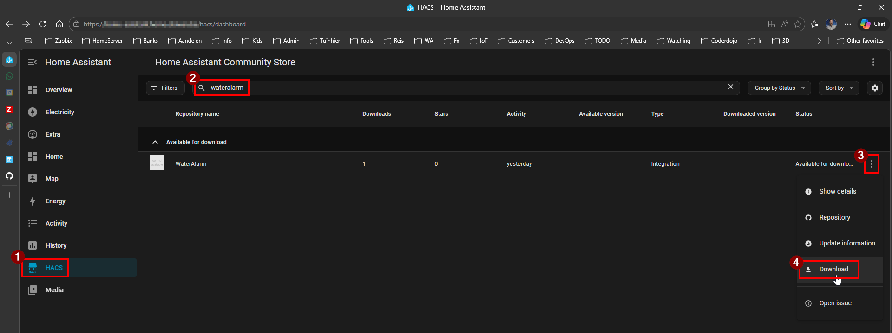
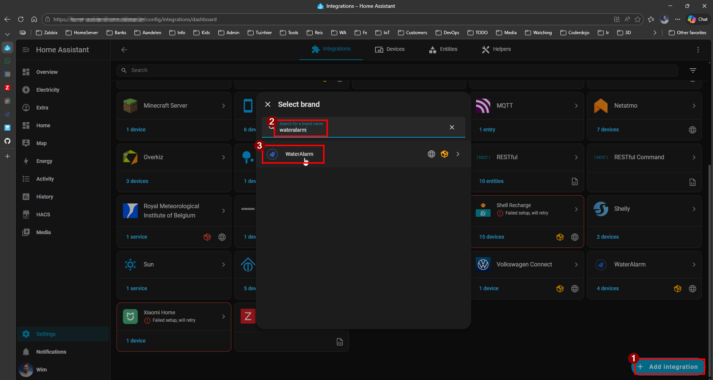
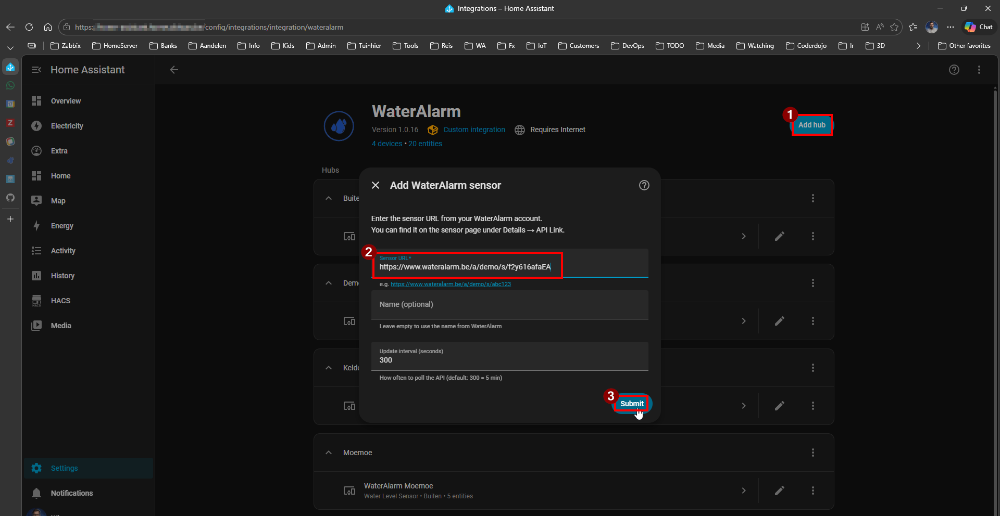
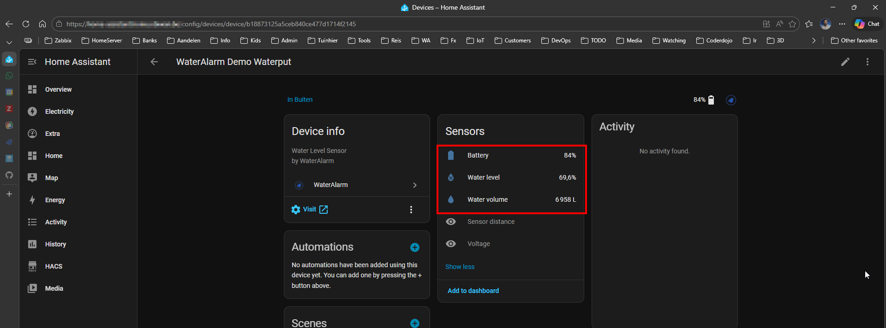
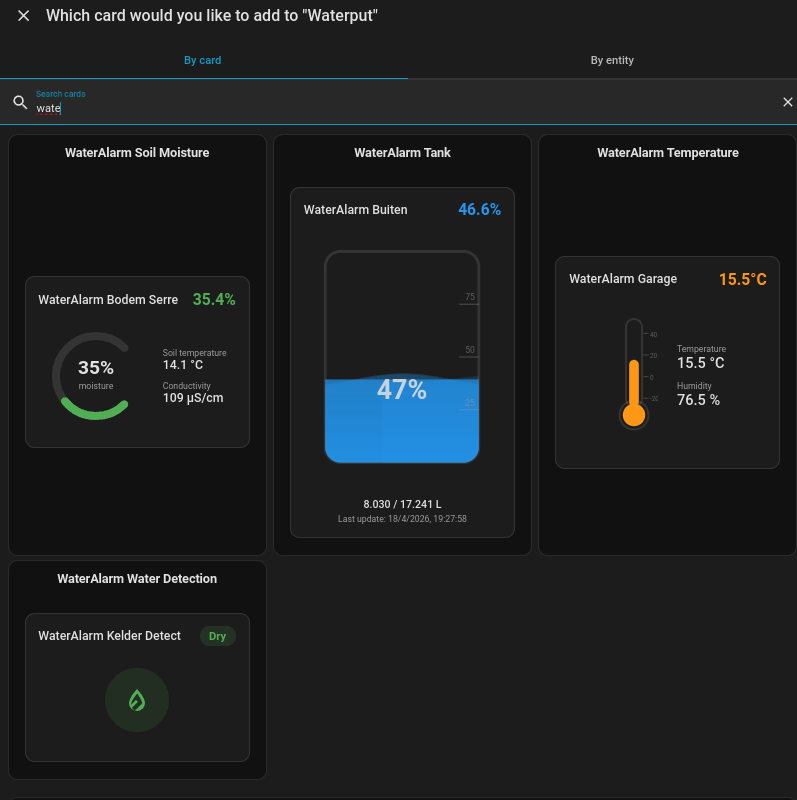

# Home Assistant

WaterAlarm heeft een Home Assistant integratie gemaakt.  Deze integratie is nog in een vroege fase, en er kunnen nog dingen veranderen.  De integratie is beschikbaar via HACS - Home Assistant Community Store, een grote verzameling van community-made integraties voor Home Assistant.  Volg deze stappan om de integratie te installeren.

## Stap 1: Installeer HACS

Eerst moet je "HACS" installeren.  De kans is groot dat je dit al hebt, want dit biedt een groot aantal extra integraties.
Als je het niet kent is het sowieso zeer interessant, ook zonder WaterAlarm.
Wanneer je HACS hebt, is dit beschikbaar via de sidebar.
Uitleg over de installatie van HACS vind je hier: https://www.hacs.xyz/docs/use/download/download/ 

## Stap 2: WaterAlarm integratie installeren via HACS

Daarna moet je instellen in HACS waar de integratie zich bevindt.

1. Custom repository toevoegen

  - In je Home Assistant ga je via de sidebar naar HACS
  - Klik rechtsboven op de "..."
  - Kies daar "Custom repositories"
  - Je krijgt een popup window "Custom repositories"
  - En voeg een nieuwe repository toe:  
    https://github.com/WimObiwan/FxWaterAlarm-HomeAssistant  
    Kies als type "Integration"  
    Klik op Add  
    Sluit deze popup window  
    
    
2. Integratie installeren via HACS
  - In HACS zoek je bovenaan naar "WaterAlarm"  
    Je vindt normaal één resultaat.
  - Klik rechts op de "..."
  - Kies "Download"
    
3. Nu kun je installeren in Home Assistant via de normale weg
  - Ga naar "Settings" --> "Devices & Services"
  - Klik op "Integrations"
  - Klik op "Add Integration"
  - Zoek naar "WaterAlarm", je vindt normaal één resultaat
  - Klik op "WaterAlarm"
    

Dit voegt WaterAlarm toe als integratie in Home Assistant.

## Stap 3: Sensoren toevoegen in WaterAlarm integratie

Nu moet je nog de sensoren toevoegen die je wilt gebruiken in Home Assistant.  Hiervoor heb je de persoonlijke link nodig van je sensor.  Deze heeft het formaat: https://www.wateralarm.be/a/abc1234567/s/xyz7654321 .

- Open de WaterAlarm integratie
- Klik op "Add Hub"
- Plak de link van je sensor, en voeg optioneel een naam toe.  Als je geen naam toevoegt, zal deze automatisch worden afgeleid van de naam van je sensor in WaterAlarm.  Je kunt deze later ook nog aanpassen.  Het type sensor wordt automatisch afgeleid van de data die beschikbaar is in de link.
- Klik op "Submit"

Dit is alles.  Je sensor is nu toegevoegd, en je kunt deze gebruiken in Home Assistant.  De sensor-waarden zijn nu beschikbaar in Automations, Dashboards,...  Je kunt een eerste controle doen door op de sensor te klikken.

Herhaal deze stap voor elke sensor die je wilt toevoegen.

## Stap 4: De sensor-gegevens op je Home-Assistant dashboard plaatsen

De WaterAlarm integratie bevat ook enkele dashboard kaarten die je kunt gebruiken.

- Ga naar het dashboard waar je de sensor-gegevens wilt plaatsen
- Klik rechtsboven op de 3 puntjes, en kies "Edit Dashboard"
- Klik op "Add Card"
- Zoek naar "WaterAlarm", en kies de kaart die je wilt gebruiken
  Momenteel zijn er 4 kaarten beschikbaar:
  - WaterAlarm Level
  - WaterAlarm Soil Moisture
  - WaterAlarm Temperature
  - WaterAlarm Water Detection
- Standaard zal deze kaart de eerste WaterAlarm sensor tonen die je hebt toegevoegd.  Je kunt dit aanpassen door een andere sensor te kiezen.
- Klik op "Save"

