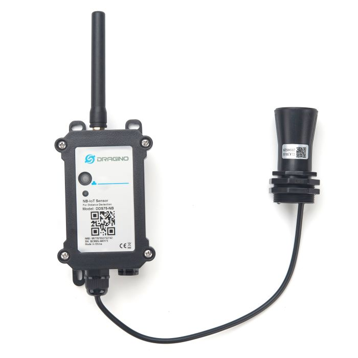

# DDS75-NB

*Foto: Dragino*

## Bediening

Dit toestel heeft een knopje om:

* Aan/af-gezet worden zonder het te openen:
    * Aanzetten
        * Druk 1 à 2 seconden op de knop
    * Afzetten
        * Druk 5x kort op de knop
          (Het lichtje kleurt even rood, en het toestel wordt uitgezet) 
* Er kan een extra meting gedaan worden, nuttig voor testen:
    * Druk 1 à 2 seconden op de knop

## 5G-ontvangst

Zit de put **in of onder een gebouw** — een kelder, een garage, of een put onder de woning of de
oprit — dan is de 5G-ontvangst er meestal te zwak.  De sensor blijft dan opnieuw proberen te
verzenden en de batterij gaat een stuk minder lang mee.  Kies in dat geval de LoRa-uitvoering
[DDS75-LB](DDS75-LB.md) met een gateway; zie
[Sensor Overzicht](/Docs/Sensor_Overzicht.md#2-5g-slechte-ontvangst-en-een-lege-batterij).

## Metingen die je moet doen (terwijl de put open is)

* Totale capaciteit van de put (in liter)
  (bvb 10000 liter)
* Afstand van de sensor tot het waterniveau dat **0%** moet zijn (in mm),
  meestal tot de bodem van de put
  (bvb 3000 mm)
* Afstand van de sensor tot het waterniveau dat **100%** moet zijn (in mm),
  meestal tot het niveau waarop de put overloopt
  (bvb 800 mm)
* (Verschil tussen de vorige 2 metingen is de bruikbare hoogte, bvb 2200 mm)
* Optioneel: onbruikbare waterhoogte onderaan (in mm), wanneer je het laatste water niet wilt
  opgebruiken omdat het vaak vuil is
  (bvb 200 mm)

Deze waarden vul je in bij de instellingen van de sensor op het WaterAlarm-platform.
