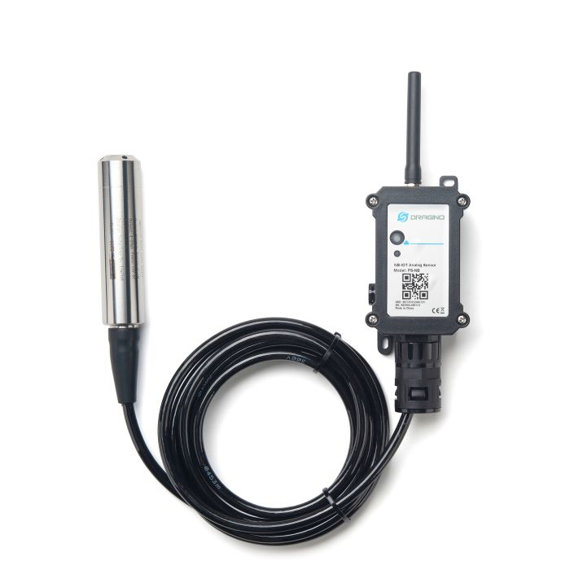

# PS-NB - Niveau-sensor met druk via 5G (NB-IoT)

*Foto: Dragino*

## Bediening

De sensormodule heeft een knopje en een lichtje.  Ze lijken op elkaar: het **knopje zit aan de
kant van de antenne** (de bovenkant).

* Aanzetten
    * Druk **3 à 4 seconden** op de knop.
    * Het lichtje kleurt groen en begint te knipperen: het toestel start op.
    * Zodra er verbinding is met het 5G-netwerk, kleurt het lichtje enkele seconden **blauw**.
      De eerste keer kan dat lang duren.
* Extra meting versturen (nuttig voor testen)
    * Druk **1 à 3 seconden** op de knop.
    * Het lichtje kleurt even blauw wanneer de meting verstuurd is.  Het kan nog even duren
      voor ze op het platform zichtbaar is.
* Afzetten
    * Druk **5x kort** op de knop.
    * Het lichtje kleurt even rood, en het toestel wordt uitgezet.

## Montage

* De **sensormodule** zet je vast met **2 schroefjes**.  Draai ze zeker niet hard aan.
* De **antenne** schroef je op de sensormodule.
* Het **houdertje voor de kabel wordt meegeleverd**, met spanbandjes.  Monteer het aan de
  zijkant van het mangat en klem de kabel erin: zo hangt de drukcel op de juiste hoogte, en hoef
  je zelf **niet in de put** te komen.
* Schuif de **plastic verpakking** van de drukcel voor je ze in het water laat zakken.
* De drukcel (het metalen uiteinde van de kabel) hangt **rechtop in het water, vlak boven de
  bodem**.
* De **kabel tussen de drukcel en de sensormodule mag je niet inkorten of plooien**; een teveel
  aan kabel rol je op.  De standaardlengte is 5 m, langere kabels zijn mogelijk.  Waarom niet
  inkorten, en hoe je de kabel beschermt: zie [Druksensor Opstelling](Druksensor_Opstelling.md).
* Doorgestuurde metingen zijn de hoogte van het wateroppervlak tot de onderkant van de druksensor (waar de gaatjes zitten).
* Wanneer de sensor een stukje boven de bodem hangt, kan dit ingesteld worden in de configuratie op het WaterAlarm-platform.

## Testen voor de installatie

Je kan de sensor perfect eerst testen in een **emmer water**.  Zet het toestel aan, hang de
drukcel in de emmer en verstuur een extra meting.  Voeg daarna water toe (of til de drukcel een
stuk op) en verstuur opnieuw een meting.  Het verschil zie je in de app onder **Grafiek** →
**Hoogte**.

## 5G-ontvangst

Zit de put **in of onder een gebouw** — een kelder, een garage, of een put onder de woning of de
oprit — dan is de 5G-ontvangst er meestal te zwak.  De sensor blijft dan opnieuw proberen te
verzenden en de batterij gaat een stuk minder lang mee.  Kies in dat geval de LoRa-uitvoering
[PS-LB](PS-LB.md) met een gateway; zie
[Sensor Overzicht](/Docs/Sensor_Overzicht.md#2-5g-slechte-ontvangst-en-een-lege-batterij).

Bij een druksensor heb je wel een mogelijkheid die de ultrasone sensor niet heeft: de
**sensormodule hangt niet noodzakelijk in de put**.  Met een langere kabel naar de drukcel, of met
een verlengkabel voor de antenne, krijg je de module of de antenne bovengronds — en dan is de
ontvangst meestal probleemloos.  Zie [Druksensor Opstelling](Druksensor_Opstelling.md).

## Metingen die je moet doen (terwijl de put open is)

* Totale capaciteit van de put (in liter)
  (bvb 10000 liter)
* Afstand van de onderkant van de druksensor tot de bovenkant van de put (in mm)
  (bvb 1990 mm)
* Optioneel: Afstand van de onderkant van de druksensor tot de bodem van de put (in mm)
  (bvb 10 mm)
  (als je dit niet meet, wordt 0 mm aangenomen)
* (Som van de vorige 2 metingen is hoogte van de put, bvb 2000 mm)
* Optioneel: waterniveau dat je wil instellen als 0%, wanneer je niet het laatste water wilt opgebruiken.  Dit kan nuttig zijn wanneer je niet alle water uit de put wilt gebruiken omdat het laatste water vaak vuil is.
  (bvb 200 mm)
  (als je dit niveau niet instelt, wordt 0% gelijkgesteld met de bodem van de put)
* Optioneel: de huidige waterhoogte in de put, ter controle of de metingen kloppen (in mm)

De hoogte van de put meet je het makkelijkst **van bovenaf met een rolmeter**: duw de rolmeter
tegen de bodem en kijk waar de onderkant van het mangat komt.  Meestal is dat een rond getal
(bvb 1800 mm bij een put van 10000 liter).  Je kan ook wachten tot de put net vol is en de
meting in de app aflezen.

Deze waarden vul je in bij de sensor op het WaterAlarm-platform, onder **Details** →
**Instellingen** (enkel wanneer je ingelogd bent).

## Hoe vaak komt er een meting?

De sensor stuurt **elke 2 uur** een meting door.  Bij IoT-toestellen is het normaal dat er af en
toe een meting verloren gaat.  Uitzonderlijk wordt een toestel door een overbelaste zendmast ook
enkele uren tot dagen niet toegelaten op het netwerk; daarna komen de metingen vanzelf weer
door.
