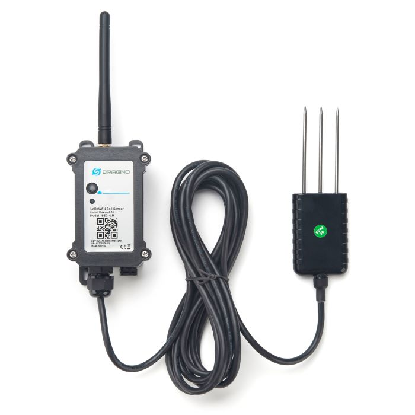

# SE01-LB - Bodemvochtsensor via LoRa (LoRaWAN)

*Foto: Dragino*

Deze sensor meet met een sonde in de grond:

* de **vochtigheid** van de bodem (%)
* de **temperatuur** van de bodem (°C)
* de **geleidbaarheid** van de bodem (µS/cm), een maat voor het zout- en meststoffengehalte

De metingen worden via LoRa doorgestuurd naar je eigen gateway, en van daar naar het
WaterAlarm-platform.

## Bediening

Dit toestel heeft een knopje om:

* Aan/af-gezet worden zonder het te openen:
    * Aanzetten
        * Druk 1 à 2 seconden op de knop
    * Afzetten
        * Druk 5x kort op de knop
          (Het lichtje kleurt even rood, en het toestel wordt uitgezet)
* Er kan een extra meting gedaan worden, nuttig voor testen:
    * Druk 1 à 2 seconden op de knop

## Montage

* Kies een plaats die representatief is voor het perceel: niet vlak naast een druppelaar of een
  sproeier, en niet op een plek waar water blijft staan.
* Steek de drie pinnen van de sonde volledig en verticaal in de grond, op de diepte waar de wortels
  zitten.
* Is de grond hard of steenachtig, maak dan eerst een gat.  Forceer de pinnen niet, ze kunnen
  buigen of breken.
* Druk de aarde daarna goed aan rond de sonde.  Luchtholtes tussen de pinnen en de grond geven
  een te lage vochtmeting.
* Hou de behuizing van de sensor boven de grond, op een plaats waar hij niet onder water komt te
  staan.
* Markeer de plaats van de sonde, zodat je er later niet met de spade of de grasmaaier in gaat.
* De sensor heeft een LoRa-gateway binnen bereik nodig.

## Instellingen op het WaterAlarm-platform

Bij deze sensor moet je niets inmeten, in tegenstelling tot een niveausensor in een put.

Nuttige alarmen onder **Sensor alarmen**:

* **Percentage onder** — een melding wanneer de bodem uitdroogt (bijvoorbeeld onder 20 %).
* **Percentage boven** — een melding wanneer de grond te nat blijft.
* Een alarm op de **temperatuur**, bijvoorbeeld bij vorst.
* **Geen data ontvangen** en **Batterij onder**, om te weten wanneer de sensor stilvalt.
