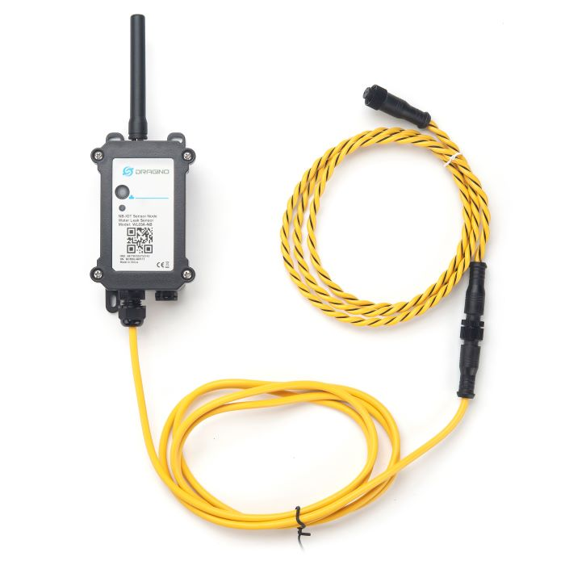

# WL03A-NB - Waterdetectie met detectiekabel via 5G (NB-IoT)

*Foto: Dragino*

Deze sensor detecteert water langs een **detectiekabel**.  Op het platform zie je de status
*Water gedetecteerd* of *Geen water gedetecteerd*, en je krijgt een e-mail zodra er water
gedetecteerd wordt.

De kabel detecteert water over zijn **volledige lengte**, niet enkel op één punt.  Hij kan
verlengd worden, ook tot meer dan 10 meter.

De metingen gaan rechtstreeks via het mobiele netwerk (NB-IoT) naar het WaterAlarm-platform.  Er
is geen gateway en geen internetverbinding ter plaatse nodig; de simkaart zit in het abonnement.

## Bediening

Dit toestel heeft een knopje om:

* Aan/af-gezet worden zonder het te openen:
    * Aanzetten
        * Druk 1 à 2 seconden op de knop
    * Afzetten
        * Druk 5x kort op de knop
          (Het lichtje kleurt even rood, en het toestel wordt uitgezet)
* Er kan een extra meting gedaan worden, nuttig voor testen:
    * Druk 1 à 2 seconden op de knop

## Montage

* Hang de sensor tegen de muur, **hoger dan het punt waar water kan komen**.  De behuizing zelf
  mag niet onder water komen te staan.
* Leg de detectiekabel plat op de vloer, op het **laagste punt** van de ruimte of vlak naast wat
  kan lekken: boiler, wasmachine, pomp, filter, verdeler.
* De kabel moet contact kunnen maken met het water.  Leg hem niet in een goot of tegen een
  plint omhoog, en niet onder een mat of tapijt.
* Wil je meerdere risicoplekken bewaken, leg de kabel dan in een lus of laat hem verlengen.
* Zet de kabel eventueel vast met een tie-wrap of een kabelklem, zodat hij niet verschuift.
* Let op de **5G-ontvangst**: kelders en technische ruimtes in beton zijn net de plaatsen waar de
  ontvangst tegenvalt.  Bij zwakke ontvangst gaat de batterij sneller leeg — zie
  [Sensor Overzicht](/Docs/Sensor_Overzicht.md#2-5g-slechte-ontvangst-en-een-lege-batterij).
  Staat de sensor **in of onder een gebouw**, dan is de LoRa-uitvoering
  [WL03A-LB](WL03A-LB.md) meestal de betere keuze.

## Testen na de installatie

1. Leg een natte doek op de detectiekabel.
2. Druk 1 à 2 seconden op de knop om een extra meting te versturen.
3. Op de sensorpagina moet de status naar **Water gedetecteerd** springen.
4. Maak de kabel daarna goed droog; de status keert dan terug naar *Geen water gedetecteerd*.

## Instellingen op het WaterAlarm-platform

Bij deze sensor moet je niets inmeten.  Zet onder **Sensor alarmen** het alarm
**Gedetecteerd** aan — dat stuurt een e-mail zodra er water gedetecteerd wordt.

Nuttig daarnaast: **Geen data ontvangen** en **Batterij onder**, om te weten wanneer de sensor
stilvalt.  Een detectiesensor die niet meer doorstuurt, geeft immers ook geen alarm meer.
