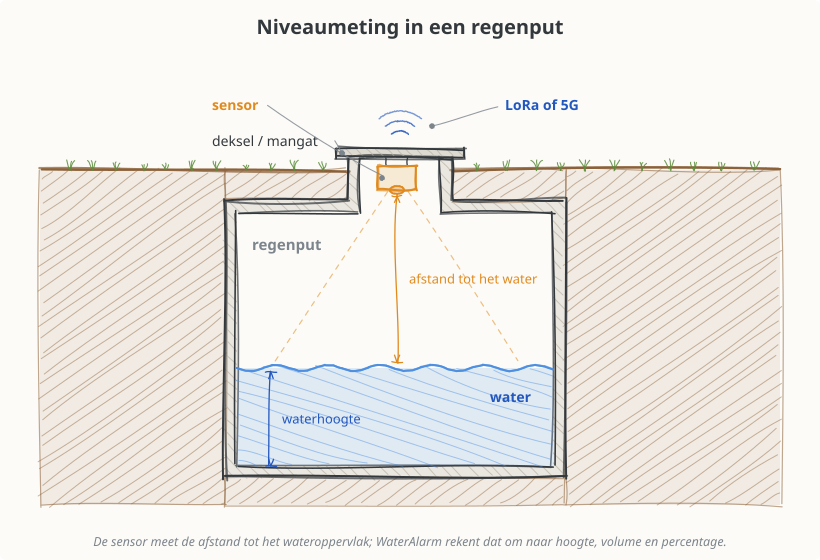
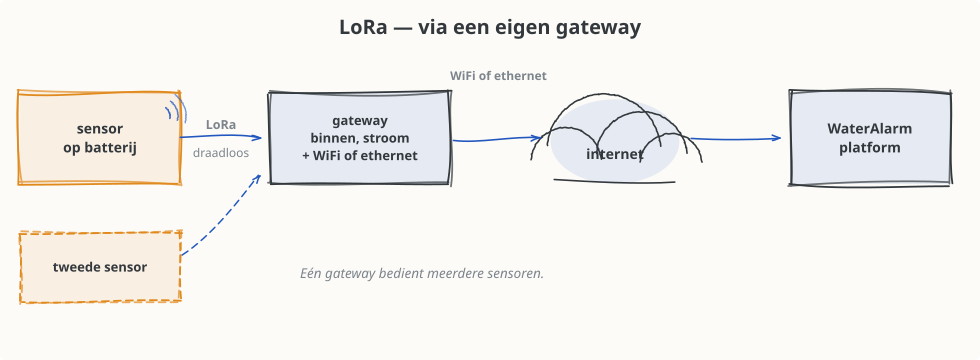
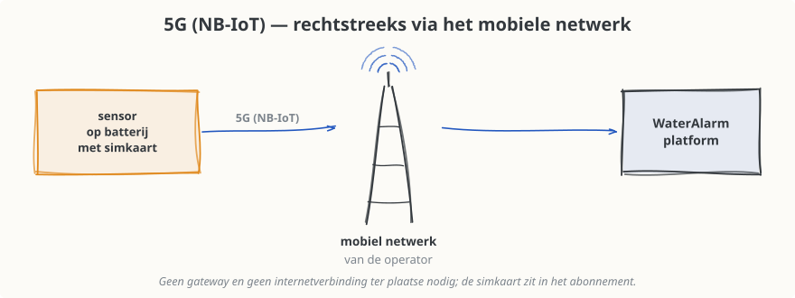
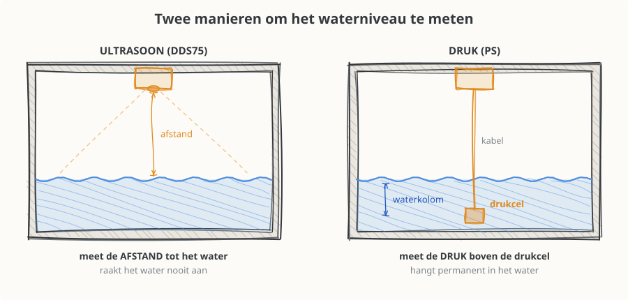
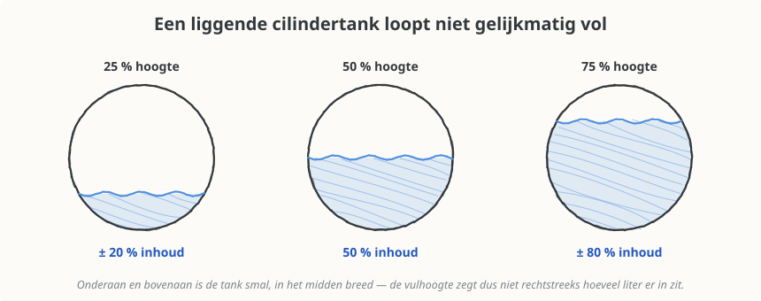
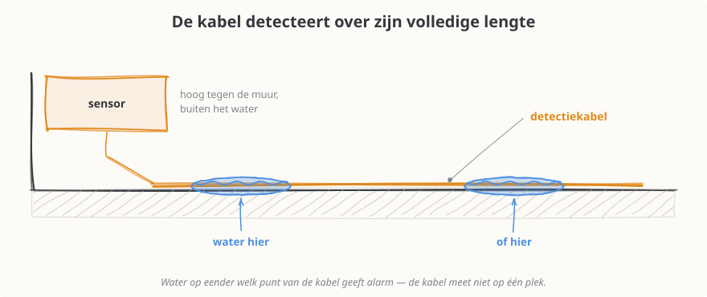
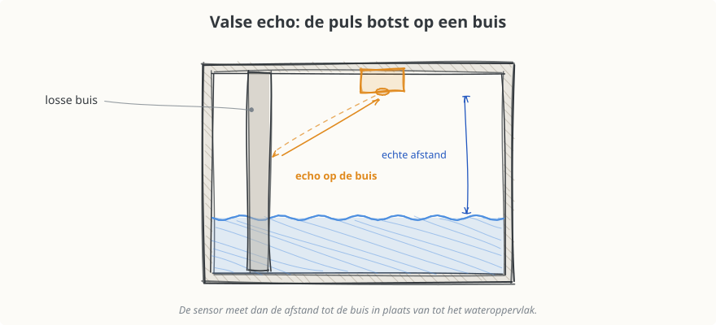
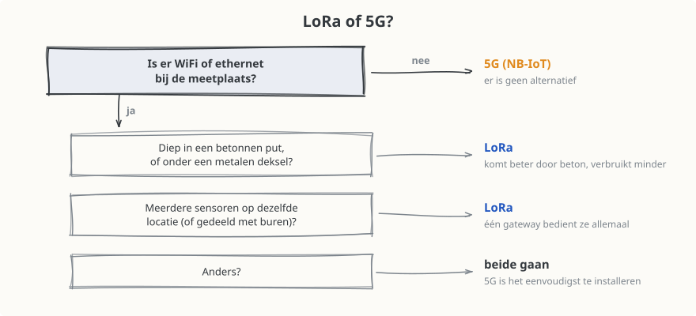
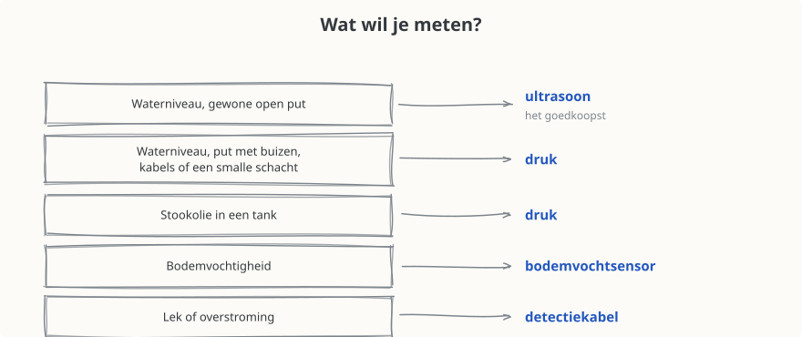

# Sensor Overzicht

WaterAlarm werkt met draadloze sensoren op batterij.  Een sensor doet op regelmatige tijdstippen
een meting en stuurt die door naar het WaterAlarm-platform.  Daar zie je de actuele waarde en de
historiek, en krijg je een e-mail wanneer een alarmgrens overschreden wordt.

Deze pagina helpt je kiezen welke sensor bij jouw situatie past.  De prijzen staan op een aparte
pagina: [Prijzen](Prijzen.md).

## Twee keuzes

Elke installatie bestaat uit twee keuzes, die je los van elkaar maakt:

1. **Wat wil je meten?** → het meetprincipe: ultrasoon, druk, bodemvochtigheid of lekdetectie.
2. **Hoe komen de metingen bij WaterAlarm?** → de verbinding: LoRa of 5G.

Elke sensor bestaat in beide uitvoeringen (LoRa en 5G).

| Wat je meet | Meetprincipe | LoRa | 5G (NB-IoT) |
|-------------|--------------|------|-------------|
| Waterniveau in put, tank of regenwaterreservoir | Ultrasoon (meet van bovenaf) | [DDS75-LB](Sensor_Nodes/DDS75-LB.md) | [DDS75-NB](Sensor_Nodes/DDS75-NB.md) |
| Waterniveau in put, tank of regenwaterreservoir | Druk (sensor hangt in het water) | [PS-LB](Sensor_Nodes/PS-LB.md) | [PS-NB](Sensor_Nodes/PS-NB.md) |
| Stookolie in een tank | Druk (sensor hangt in de stookolie) | [PS-LB](Sensor_Nodes/PS-LB.md) | [PS-NB](Sensor_Nodes/PS-NB.md) |
| Bodemvochtigheid in tuin, veld of serre | Bodemvochtsensor | [SE01-LB](Sensor_Nodes/SE01-LB.md) | [SE01-NB](Sensor_Nodes/SE01-NB.md) |
| Waterlek of overstroming | Detectiekabel | [WL03A-LB](Sensor_Nodes/WL03A-LB.md) | [WL03A-NB](Sensor_Nodes/WL03A-NB.md) |

## Hoe komen de metingen bij WaterAlarm?

### LoRa — via een eigen gateway

De sensor stuurt zijn meting via LoRa naar een **gateway** die jij zelf op de locatie plaatst.
Die gateway staat binnen, heeft stroom nodig en een **WiFi- of ethernetverbinding** naar het
internet.

* **Eén gateway bedient meerdere sensoren.**  Heb je meerdere putten of meetpunten op dezelfde
  locatie, dan koop je de gateway maar één keer.
* Er komt **geen simkaart en geen mobiele operator** aan te pas: de metingen lopen over je eigen
  internetaansluiting.
* De gateway is een **eenmalige aankoop**, maar wel een extra kost bij de eerste sensor.

### 5G — rechtstreeks via het mobiele netwerk

De sensor heeft een simkaart aan boord en stuurt zijn meting rechtstreeks door over het netwerk
van een mobiele operator (NB-IoT).  Er is geen gateway, geen WiFi en geen apparatuur binnenshuis
nodig.

* **De simkaart is inbegrepen in het abonnement.**  Je hoeft zelf geen simkaart te kopen en geen
  contract bij een mobiele operator af te sluiten; de dataverbinding zit mee in de prijs.
* Ideaal voor een **losstaande locatie**: een weide, een tweede verblijf, een put ver van de
  woning, een plaats zonder internetverbinding.
* Werkt alleen als er ter plaatse **voldoende ontvangst** is — zie
  [Wat kan er misgaan?](#wat-kan-er-misgaan)
* **Zit de sensor in of onder een gebouw** — een kelder, een garage, een technische ruimte, een
  put onder de woning of onder een oprit — dan is de 5G-ontvangst er meestal te zwak.  Kies daar
  in de regel voor LoRa.

### LoRa of 5G?

| | **LoRa** | **5G (NB-IoT)** |
|---|---|---|
| Prijs van de sensor | **Goedkoper** | Ongeveer 20 € duurder |
| Gateway nodig? | **Ja**, eenmalige aankoop | Nee |
| Internetverbinding ter plaatse? | **Ja**, WiFi of ethernet voor de gateway | Nee |
| Meerdere sensoren | Delen dezelfde gateway | Elke sensor werkt op zichzelf |
| Verwachte batterijduur | **± 5 jaar** | ± 3 jaar, afhankelijk van de ontvangst |
| Bereik door beton en gesloten deksels | Goed | Wisselend, afhankelijk van de locatie |
| Sensor in of onder een gebouw (kelder, garage, technische ruimte) | **Ja**, de aangewezen keuze | Meestal te weinig ontvangst |
| Simkaart en dataverbinding | Niet van toepassing | Inbegrepen in het abonnement |
| Afhankelijk van een mobiele operator | Nee | Ja |
| Beste bij | Meetplaats met WiFi in de buurt, in of onder een gebouw, en zeker bij twijfelachtige 5G-ontvangst | Losstaande locatie in open lucht, zonder internetverbinding |

> **Kies niet op prijs alleen.**  Een LoRa-sensor is 20 € goedkoper dan zijn 5G-tegenhanger, maar
> de gateway kost eenmalig 130 € (zie [Prijzen](Prijzen.md)).  De keuze maak je dus vooral op de
> omstandigheden: **is er internet ter plaatse** (dan kan LoRa) en **is er voldoende 5G-ontvangst
> op de meetplaats** (anders moet het LoRa zijn).  In of onder een gebouw is dat laatste zelden het
> geval.

## Waterniveau meten: ultrasoon of druk

Beide sensoren geven hetzelfde resultaat op je dashboard — het niveau in mm, het percentage en
het volume in liter — maar ze meten op een heel andere manier.

| | **Ultrasoon** | **Druk** |
|---|---|---|
| Prijs | **Goedkoper** (het voordeligste toestel) | Duurder |
| Montage | Bovenaan in het deksel of tegen de bovenkant | Kabel laten zakken tot vlak boven de bodem |
| Contact met het water | Geen | Permanent in het water |
| Gevoelig voor buizen, kabels, ladders in de put | **Ja** — kan valse echo's geven | Nee |
| Gevoelig voor een smalle of onregelmatige schacht | **Ja** | Nee |
| Gevoelig voor schuim of sterke golfslag | Ja | Beperkt |
| Werkt in een smalle buis of peilbuis | Moeilijk | **Ja** |
| Geschikt voor stookolie | Nee | **Ja** |
| Beste bij | Een normale, open put of tank met een vrije doorgang naar het water | Moeilijke putten, smalle schachten, of waar ultrasoon niet betrouwbaar meet |

> **Kort:** begin bij ultrasoon — dat is het goedkoopste en volstaat voor de meeste regenputten.
> Kies druk wanneer de put obstakels bevat, wanneer de schacht smal of onregelmatig is, of wanneer
> een ultrasone sensor ter plaatse geen stabiele meting geeft.

Wat je precies moet opmeten bij de installatie, staat per toestel beschreven bij de
[Sensor Nodes](Sensor_Nodes/).

## Stookolietanks

Naast water volgt WaterAlarm ook het niveau van een **stookolietank** op — met dezelfde
**druksensor** ([PS-LB](Sensor_Nodes/PS-LB.md) of [PS-NB](Sensor_Nodes/PS-NB.md)).  Je ziet
hoeveel liter er nog in de tank zit en welk percentage dat is, en je kan een alarm instellen dat
je verwittigt wanneer het tijd is om bij te bestellen.

Een stookolietank verschilt op twee punten van een regenput.  Met beide houdt WaterAlarm
automatisch rekening — je moet zelf niets omrekenen.

### Stookolie is lichter dan water

Een druksensor meet het gewicht van de vloeistofkolom boven zich.  Stookolie weegt ongeveer
840 kg/m³, tegenover 1.000 kg/m³ voor water: dezelfde hoogte stookolie duwt dus minder hard op de
sensor.  Zou je daar geen rekening mee houden, dan lijkt de tank leger dan hij is.

In de instellingen van de sensor geef je daarom de **massadichtheid van de vloeistof** op.
WaterAlarm rekent het gemeten drukverschil dan om naar de juiste vloeistofhoogte.  Vul je niets
in, dan gaat het systeem uit van water (1.000 kg/m³).

### Een liggende cilindertank loopt niet gelijkmatig vol

In een rechthoekige put komt er bij elke centimeter stijging evenveel liter bij.  In een liggende
cilindertank niet: onderaan en bovenaan is de tank smal, in het midden breed.  De vulhoogte zegt
dus niet rechtstreeks hoeveel liter er nog in zit.

WaterAlarm rekent daarom met de werkelijke vorm van een liggende cilinder in plaats van met de
hoogte alleen:

| Vulhoogte | Werkelijke inhoud |
|---|---|
| 25 % | ± 20 % |
| 50 % | 50 % |
| 75 % | ± 80 % |

* Je stelt de tank in als **liggende cilinder**, samen met de inhoud in liter.  De diameter hoef
  je niet apart op te meten: die leidt WaterAlarm af uit de ingestelde afstanden.
* De berekening wordt geschaald naar de **opgegeven inhoud**, zodat ook tanks met bolle uiteinden
  het juiste aantal liter tonen.
* Op de sensorpagina krijg je een **aangepast diagram**: een ronde dwarsdoorsnede in plaats van
  een rechthoekige tank.

> Laat bij je bestelling weten dat het om een stookolietank gaat, en of het een liggende
> cilindertank is.  Dan zetten we de massadichtheid en de geometrie meteen goed.

## Andere sensoren

### Bodemvochtigheid

Een sensor met een sonde die je in de grond steekt.  Hij meet:

* de **bodemvochtigheid** in %;
* de **bodemtemperatuur** in °C;
* de **geleidbaarheid** van de bodem (een maat voor het zoutgehalte / de bemesting).

Typisch gebruik: tuin, moestuin, serre of veld — een alarm wanneer de grond te droog wordt, of
opvolging van het effect van de beregening.

Toestellen: [SE01-LB](Sensor_Nodes/SE01-LB.md) (LoRa) en [SE01-NB](Sensor_Nodes/SE01-NB.md) (5G).

### Waterlekdetectie met detectiekabel

Een sensor met een **detectiekabel** die je op de vloer legt, langs een leiding of in een
lekbak.  De kabel detecteert water op eender welk punt over zijn hele lengte, niet enkel op één
plek.

Typisch gebruik: kelder, stookruimte, technische ruimte, onder een boiler of wasmachine, of naast
een pomp.  De sensor geeft een **status** door (droog / nat) en stuurt een alarm zodra er water
gedetecteerd wordt.

> **De detectiekabel kan verlengd worden**, ook tot meer dan 10 meter.  Zo bewaak je met één
> sensor een volledige kelder, een lange leiding of verschillende risicoplekken tegelijk.  Geef bij
> je bestelling door welke lengte je nodig hebt.

Toestellen: [WL03A-LB](Sensor_Nodes/WL03A-LB.md) (LoRa) en [WL03A-NB](Sensor_Nodes/WL03A-NB.md)
(5G).

## Batterijduur

Alle sensoren werken op batterij; er is geen stroomaansluiting nodig op de meetplaats.  Hoe lang
die batterij meegaat, hangt vooral af van de gekozen verbinding:

| Verbinding | Verwachte batterijduur |
|---|---|
| **LoRa** | ± 5 jaar |
| **5G (NB-IoT)** | ± 3 jaar, afhankelijk van de 5G-ontvangst |

* Een **LoRa-sensor** verbruikt weinig per meting, en haalt daardoor de langste levensduur.
* Een **5G-sensor** verbruikt meer, en de ontvangst ter plaatse maakt een groot verschil.  Bij
  goede ontvangst haal je de verwachte drie jaar; bij zwakke ontvangst blijft de sensor opnieuw
  proberen om zijn meting door te sturen, en gaat de batterij een stuk minder lang mee — zie
  [5G: slechte ontvangst en een lege batterij](#2-5g-slechte-ontvangst-en-een-lege-batterij).
* Het zijn **richtcijfers**.  Ook de meetfrequentie speelt mee: een sensor die vaker meet, gaat
  minder lang mee.

Je hoeft dit niet zelf op te volgen: op de sensorpagina staat een grafiek **Batterij** met het
verloop van het batterijniveau, en je kan een **alarm op de batterij** instellen, zodat je een
e-mail krijgt voor de batterij leeg is.

Een **vervangbatterij zit in het abonnement**, tot één batterij per sensor per jaar; enkel de
eventuele verzendingskosten komen daar nog bij (zie [Prijzen](Prijzen.md)).

Wil je de batterij helemaal niet of veel minder vaak vervangen, dan is een zonnepaneel de
oplossing.

## Zonnepaneel

De meeste sensoren zijn ook leverbaar met een **ingebouwd zonnepaneel**.  Het paneel laadt de
batterij bij, waardoor de sensor veel langer meegaat en je de batterij niet of veel minder vaak
moet vervangen.

* Interessant overal waar de sensor (of zijn paneel) **voldoende daglicht** krijgt: buiten, op een
  paal, tegen een muur, of onder een lichtdoorlatend deksel.
* Weinig zinvol wanneer de sensor volledig in een gesloten, donkere put zit — daar blijft de
  gewone batterij de betere keuze.
* Zeker aan te raden bij sensoren die vaker meten of die meer verbruiken (bijvoorbeeld bij matige
  5G-ontvangst).

> **Bij een installatie met abonnement is het zonnepaneel gratis.**  Vraag het bij je bestelling
> aan, dan kijken we samen of het op jouw locatie zinvol is.

## Wat kan er misgaan?

**Niet elke sensor past bij elke toepassing.**  Welke sensor de juiste is, hangt af van de
concrete omstandigheden van de put, de tank of de omgeving: de vorm en de diepte, wat er allemaal
in de put hangt, of er ontvangst is, of er een internetverbinding in de buurt is.  Beschrijf je
situatie daarom bij de bestelling — dan kunnen we vooraf de juiste keuze maken in plaats van
achteraf om te wisselen.

Hieronder de drie zaken die in de praktijk het vaakst mislopen.

### 1. Ultrasoon: valse echo's door buizen en kabels

De ultrasone sensor stuurt een geluidspuls naar beneden en meet hoe lang het duurt voor de echo
terugkomt.  Hangt er iets in de weg — een aanvoerbuis, een overloop, een pompkabel, een ladder,
een uitstekende rand van het mangat — dan kan de sensor de echo van dát obstakel meten in plaats
van die van het wateroppervlak.

**Symptomen:**

* een niveau dat altijd hetzelfde blijft, ook al gebruik je water;
* een niveau dat heen en weer springt;
* een waarde die niet klopt met wat je in de put ziet.

**Oplossingen, in volgorde van eenvoud:**

1. **De sensor verplaatsen** naar een punt met een vrije baan naar het water.
2. **Buizen en kabels tegen de wand bevestigen** met een beugel of een tie-wrap, zodat ze uit de
   meetkegel blijven.
3. **Overstappen naar een druksensor.**  Die heeft geen last van obstakels, en is de definitieve
   oplossing voor moeilijke putten.

### 2. 5G: slechte ontvangst en een lege batterij

Een 5G-sensor onderin een betonnen put, onder een metalen deksel, **in of onder een gebouw** of
ver van een zendmast heeft soms te weinig signaal.  Een kelder, een garage, een technische ruimte
of een put onder de woning zijn de lastigste plaatsen: het signaal moet dan door een vloerplaat of
door meerdere muren.  De sensor blijft dan opnieuw proberen om zijn meting door te sturen, en
**dat verbruikt veel batterij**.  Het gevolg is niet meteen zichtbaar: de metingen komen wel
binnen, maar in plaats van de verwachte ± 3 jaar is de batterij veel sneller leeg — en soms vallen
metingen weg.  De grafiek **Batterij** op de sensorpagina laat dit als eerste zien: het niveau
zakt dan zichtbaar sneller dan normaal.

**Oplossingen:**

1. **De sensor of de antenne hoger plaatsen**, of het metalen deksel vervangen door een
   kunststof exemplaar.
2. **Een zonnepaneel toevoegen**, zodat het hogere verbruik gecompenseerd wordt.
3. **Overstappen naar een LoRa-sensor met gateway.**  LoRa komt veel beter door beton en door een
   gesloten deksel, en verbruikt minder.  Voor een sensor in of onder een gebouw is dat meestal
   meteen de juiste keuze — daar valt met plaatsing weinig te winnen.

### 3. LoRa: gateway te ver, of geen internet

De gateway moet de sensor kunnen horen én zelf op het internet geraken.

* Te veel muren, beton of afstand tussen sensor en gateway → geen of onregelmatige metingen.
  Verplaats de gateway naar een plaats dichter bij de sensor, of hoger (bijvoorbeeld op zolder of
  op een verdieping).
* **Geen WiFi of ethernet ter plaatse** → een LoRa-installatie is dan niet mogelijk.  Kies in dat
  geval voor 5G.

## Welke sensor kies ik?

### LoRa of 5G?

**Kort:** geen internet ter plaatse → 5G.  In of onder een gebouw, diep in beton of onder een
metalen deksel → LoRa.  In alle andere gevallen gaan beide, en is 5G het eenvoudigst te
installeren.

### Wat wil je meten?

**Kort:** waterniveau in een gewone open put → ultrasoon.  Put met buizen, kabels of een smalle
schacht, en stookolietanks → druk.  Bodemvochtigheid → bodemvochtsensor.  Lek of overstroming →
detectiekabel.

## Meer informatie

* [Prijzen](Prijzen.md) — prijslijst en abonnement
* [Sensor Nodes](Sensor_Nodes/) — bediening en montage per toestel
* [Integraties](Integraties/) — API, Home Assistant
